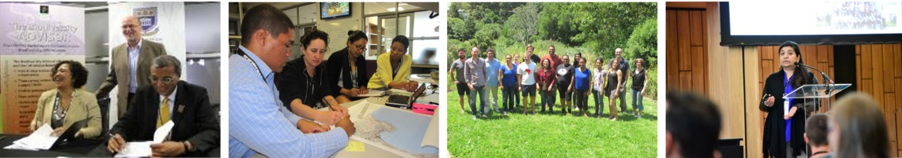
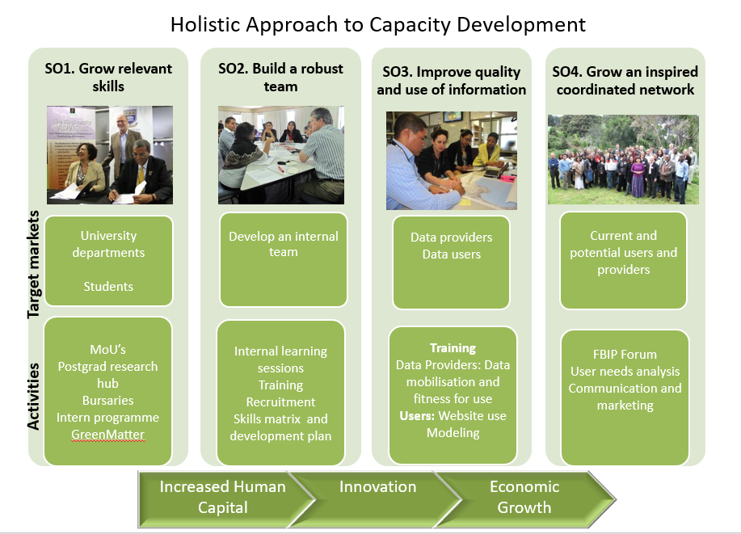

In South Africa, as in other parts of the world, Biodiversity Informatics is a young field, lies at the nexus of a number of disciplines. The broad application of information science and computational tools to the management and analysis of biodiversity data including species’ occurrences, taxonomic characters, and multimedia and image data, have led to the development of the emerging field of biodiversity informatics.  Thus, biodiversity informatics deals with the interrelated challenges of collection, collation, integration, analysis and prediction, as well as the dissemination of data and information related to the biotic resources of the Earth.
  
Being such a new and dynamic field, there are enormous challenges in recruitment, training and retention of biodiversity information management personnel, to
support the mobilisation, management, coordination and utilisation of biodiversity information for key conservation and biodiversity outcomes, and initiatives
such as IPBES and the Aichi targets that require relevant data to meet the science-policy and decision-making needs.

This demands broad efforts to build human capital in the field.

The South African Node of GBIF (SANBI-GBIF) has a mandate to share biodiversity data freely and openly, to GBIF, through a knowledge management platform in support 
of science, policy and decision-making.  In order to support this activity at the national level, and to support the move towards a knowledge economy, 
the SANBI-GBIF Node has been instrumental in developing a **holistic approach to capacity development in Biodiversity Informatics.**  This includes: 

- a 5 year strategy and a curriculum for biodiversity informatics which is core to the development of academic and work-based teaching and training efforts;
- developing robust in-house capacity
- to improve the quality and use of data
- to grow an inspired and coordinated network in biodiversity informatics/information management

  

